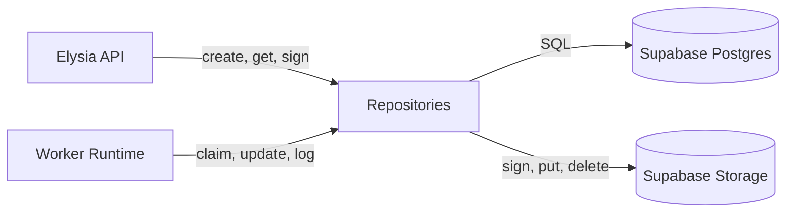

<!-- artifact_id: 9a9c2ee0-3bc3-4b34-b54b-1e2bb0ef1d5f -->

# Data Layer — Design (Supabase + Drizzle)

## Overview

Implement a minimal, scalable schema on Supabase Postgres with type-safe access via Drizzle. Provide repository functions for API and workers, enforce clean state transitions, and enable efficient cleanup and observability.

---

## Architecture



Components:

-   Schema (SQL/Drizzle): tables, indexes, enums.
-   Repositories: typed CRUD + transitions (transactional where needed).
-   Storage client: helper to build canonical keys and sign URLs.

---

## Schema (Drizzle pseudo-code)

```ts
import {
    pgEnum,
    pgTable,
    uuid,
    varchar,
    text,
    timestamp,
    integer,
    boolean,
    jsonb,
    index,
} from 'drizzle-orm/pg-core';

export const jobStatus = pgEnum('job_status', [
    'queued',
    'processing',
    'done',
    'failed',
]);

export const jobs = pgTable(
    'jobs',
    {
        id: uuid('id').primaryKey().defaultRandom(),
        status: jobStatus('status').notNull().default('queued'),
        priority: varchar('priority', { length: 16 })
            .notNull()
            .default('normal'),
        shard: integer('shard').notNull().default(0),
        sourceType: varchar('source_type', { length: 16 }).notNull(), // 'upload' | 'youtube'
        sourceKey: varchar('source_key', { length: 512 }),
        sourceUrl: varchar('source_url', { length: 1024 }),
        startSec: integer('start_sec').notNull(),
        endSec: integer('end_sec').notNull(),
        withSubtitles: boolean('with_subtitles').notNull().default(false),
        burnSubtitles: boolean('burn_subtitles').notNull().default(false),
        subtitleLang: varchar('subtitle_lang', { length: 16 }).default('auto'),
        // progress & attempts
        progress: integer('progress').notNull().default(0), // 0..100
        attempts: integer('attempts').notNull().default(0),
        lastHeartbeatAt: timestamp('last_heartbeat_at', { withTimezone: true }),
        // results
        resultVideoKey: varchar('result_video_key', { length: 512 }),
        resultSrtKey: varchar('result_srt_key', { length: 512 }),
        // errors
        errorCode: varchar('error_code', { length: 64 }),
        errorMessage: text('error_message'),
        // bookkeeping
        createdAt: timestamp('created_at', { withTimezone: true })
            .defaultNow()
            .notNull(),
        updatedAt: timestamp('updated_at', { withTimezone: true })
            .defaultNow()
            .notNull(),
        expiresAt: timestamp('expires_at', { withTimezone: true }),
    },
    (t) => ({
        byStatusCreated: index('idx_jobs_status_created_at').on(
            t.status,
            t.createdAt
        ),
        byExpiresAt: index('idx_jobs_expires_at').on(t.expiresAt),
    })
);

export const jobEvents = pgTable(
    'job_events',
    {
        id: uuid('id').primaryKey().defaultRandom(),
        jobId: uuid('job_id')
            .notNull()
            .references(() => jobs.id, { onDelete: 'cascade' }),
        ts: timestamp('ts', { withTimezone: true }).defaultNow().notNull(),
        type: varchar('type', { length: 64 }).notNull(),
        data: jsonb('data').$type<Record<string, unknown>>(),
    },
    (t) => ({
        byJobTs: index('idx_job_events_job_id_ts').on(t.jobId, t.ts),
    })
);

export const apiKeys = pgTable(
    'api_keys',
    {
        id: uuid('id').primaryKey().defaultRandom(),
        name: varchar('name', { length: 128 }).notNull(),
        keyHash: varchar('key_hash', { length: 128 }).notNull(), // bcrypt/argon2 hash
        scopes: varchar('scopes', { length: 256 }).default(''),
        rateLimitPerMin: integer('rate_limit_per_min').default(60),
        createdAt: timestamp('created_at', { withTimezone: true })
            .defaultNow()
            .notNull(),
        revokedAt: timestamp('revoked_at', { withTimezone: true }),
    },
    (t) => ({
        byKeyActive: index('idx_api_keys_active').on(t.keyHash, t.revokedAt),
    })
);
```

Notes:

-   Keep enum for `status` to enforce valid states.
-   Optional `api_keys` table only if ADMIN_ENABLED + API key auth is turned on.
-   use Buns built in hashing

---

## Storage Layout

-   Bucket `sources` (private): `sources/{jobId}/source.ext`.
-   Bucket `results` (private): `results/{jobId}/clip.mp4`, `results/{jobId}/clip.srt`.
-   Signed URL TTL: 5–15 minutes (configurable).

Helper (TS):

```ts
export const storageKeys = {
    source: (jobId: string, ext: string) => `sources/${jobId}/source.${ext}`,
    resultVideo: (jobId: string) => `results/${jobId}/clip.mp4`,
    resultSrt: (jobId: string) => `results/${jobId}/clip.srt`,
};
```

---

## Repository Interfaces

```ts
export interface ServiceResult<T> {
    ok: boolean;
    data?: T;
    code?: string;
    message?: string;
}

export interface JobsRepo {
    create(input: Partial<InsertJob>): Promise<ServiceResult<Job>>;
    get(id: string): Promise<ServiceResult<Job | null>>;
    update(id: string, patch: Partial<UpdateJob>): Promise<ServiceResult<Job>>;
    listByStatus(
        status: JobStatus,
        limit: number
    ): Promise<ServiceResult<Job[]>>;
    transition(
        id: string,
        next: JobStatus,
        patch?: Partial<UpdateJob>,
        event?: JobEventInput
    ): Promise<ServiceResult<Job>>;
}

export interface JobEventsRepo {
    add(event: JobEventInput): Promise<ServiceResult<void>>;
    list(jobId: string, limit?: number): Promise<ServiceResult<JobEvent[]>>;
}

export interface StorageRepo {
    upload(localPath: string, key: string): Promise<ServiceResult<void>>;
    sign(key: string, ttlSec?: number): Promise<ServiceResult<string>>;
    remove(key: string): Promise<ServiceResult<void>>;
}
```

Transactional pattern:

```ts
// within a tx: update jobs + insert job_events
await db.transaction(async (tx) => {
    await tx
        .update(jobs)
        .set({ status: next, updatedAt: sql`now()` })
        .where(eq(jobs.id, id));
    await tx
        .insert(jobEvents)
        .values({ jobId: id, type: 'transition', data: { next } });
});
```

---

## Error Handling

-   Use `ServiceResult` for all repo methods; map DB/storage failures to codes like `DB_CONFLICT`, `NOT_FOUND`, `STORAGE_SIGN_FAILED`.
-   Avoid leaking DSNs, keys, or bucket names in error messages.

---

## Migration Strategy

-   Use Drizzle migrations checked into VCS.
-   Forward-only; include safe defaults and indexes.
-   Local bootstrap script creates buckets `sources`, `results` if missing.

---

## Testing Strategy

-   Unit tests: repositories with a local Postgres (Docker) and a mocked Supabase Storage client.
-   Integration tests: create job → event → transition → sign URL happy path.
-   Cleanup tests: insert expired rows → run cleanup → verify cascades and storage deletes.

---

## Performance Considerations

-   Index-only hot paths: `(status, created_at)` for dashboards and cleanup; `expires_at` for TTL scans.
-   Keep `job_events` append-only; avoid wide rows in `jobs`.
-   Defer table partitioning until real load justifies it; design schemas to be partition-ready.
