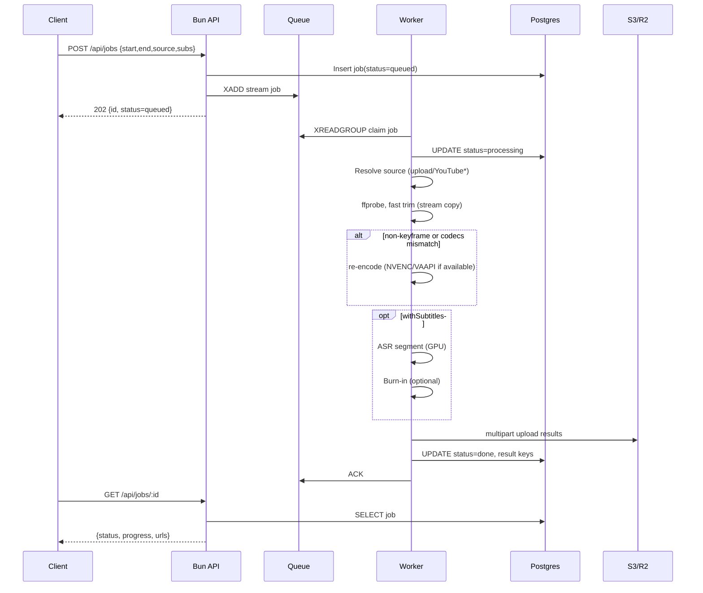
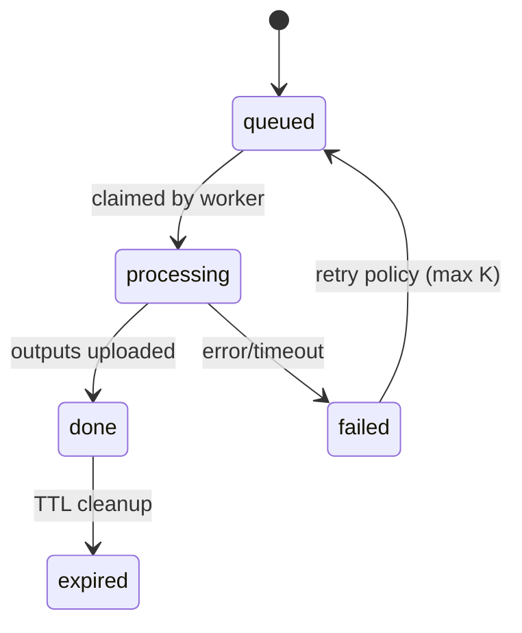

# High‑Performance Design Document

## Objective

Design the **highest‑throughput, lowest‑latency** version of the YouTube/File clipper with optional subtitles. Prioritize CPU/GPU efficiency, horizontal scalability, and predictable latency under load.

-   **Edge/API**: Bun + Elysia (TypeScript) for request handling, validation, and orchestration.
-   **Workers**: Go (static binary) _and/or_ Bun Workers. Default to **Go workers** for peak stability and RSS predictability; keep an abstraction so Bun Workers can be swapped in for simpler deploys.
-   **Media**: FFmpeg (+ hardware acceleration when available).
-   **ASR**: Faster‑Whisper / whisper.cpp with GPU (CUDA/ROCm) or hosted ASR for burst traffic.
-   **Queue**: Redis Streams (or NATS JetStream) with at‑least‑once semantics.
-   **DB**: Postgres with partitioned job tables; Drizzle for migrations & types.
-   **Storage**: Local NVMe scratch + S3/R2 for durable results; multipart uploads for egress.

---

## Architecture (C4‑ish)

```mermaid
flowchart LR
  subgraph Client
    UI[SPA / CLI / API client]
  end

  subgraph Edge
    Elysia[Bun + Elysia API]
    RL[Rate Limiter]
  end

  subgraph Control
    Q[Redis Streams / NATS JS]
    PG[(Postgres)]
  end

  subgraph Workers
    W1[Go Worker Pool\n(ffmpeg, ASR, mux)]
    W2[Bun Workers (optional)]
  end

  subgraph Storage
    NVME[/Local NVMe Scratch/]
    S3[(S3/R2)]
  end

  UI -->|POST /api/jobs| Elysia
  Elysia --> RL
  RL -->|accept| Elysia
  Elysia -->|validate & persist| PG
  Elysia -->|enqueue| Q
  W1 <-->|claim/ack| Q
  W1 -->|progress| PG
  W1 --> NVME
  W1 -->|upload results| S3
  Elysia -->|GET /api/jobs/:id| PG
  Elysia -->|GET result| S3
```

---

## Job Lifecycle (Sequence)



---

## Performance Principles

1. **Do the least work**: prefer stream‑copy (`-c copy`) when GOP alignment permits.
2. **Work where the data is**: pull to **local NVMe**, process, then push via **multipart**.
3. **Exploit hardware**: NVENC/VAAPI/QSV for re‑encode paths; GPU ASR.
4. **Exploit queues**: backpressure, priorities, and batch ASR where valid.
5. **Avoid hot locks**: stateless workers; shard by jobId to reduce contention.
6. **Zero‑downtime**: rolling updates; idempotent job steps and resumable uploads.

---

## Critical Path Optimizations

### Trimming

-   **Fast path**: `ffmpeg -ss <start> -to <end> -i INPUT -c copy -avoid_negative_ts 1 OUTPUT.mp4`
-   **Precision path** (when frame‑accurate is needed): `-ss` _after_ `-i` plus `-copyts` and smart `-force_key_frames` on a prepass when viable.
-   **Codec pass‑through**: If output container supports input codecs, avoid re‑encode entirely.

### Re‑encode (when necessary)

-   Use **H.264** via **NVENC** (or **VAAPI/QSV**) with `-preset p1/p2`, target **CRF‑like** via `-cq` or fixed `-b:v` for predictability.
-   Audio: `-c:a aac -b:a 160k` (or stream copy if matching).
-   Pin worker process CPU affinity for consistent caches under heavy load.

### Subtitles / ASR

-   **Segment‑only transcription**: feed only `[start,end]` audio to ASR.
-   **GPU ASR**: Faster‑Whisper, batch multiple tiny jobs to amortize GPU kernel launches.
-   **Burn‑in**: Single pass when possible: `-filter_complex [0:v][subs]overlay` or `subtitles=` with styles.

### I/O & Storage

-   **Scratch**: tmpfs/NVMe with quotas; spill to disk only when required.
-   **Upload**: S3 multipart with 8–16 concurrent parts; `--expected-size` for fewer ListParts calls.
-   **Download**: Prefer progressive HTTP range; for YouTube (if enabled), ytdlp with **throttling off** and max retries low.

### Queueing & Concurrency

-   **Redis Streams**: consumer groups with per‑worker prefetch=1..N; visibility timeout smaller than P95 job to catch stalls.
-   **Priorities**: separate streams (e.g., `clips.fast`, `clips.subs`) or message field `priority` + consumer scheduling.
-   **Backpressure**: API inserts to DB even when queue is saturated but returns `429` with `retryAfter` when system is at limit.

---

## Components

### API (Bun + Elysia)

-   Validates with Zod, writes job row (status=queued), enqueues to Redis/NATS.
-   Provides **signed result URLs** (short TTL) and a **progress** view (computed from worker heartbeats or parsed ffmpeg timecodes persisted to DB).
-   Rate limiting (sliding window) + global circuit breaker (shed load when NVMe or queue saturation detected).

### Worker (Go preferred; Bun Worker optional)

-   Long‑running daemon; prewarms **FFmpeg** and **ASR** resources.
-   **Idempotent**: if the same jobId appears, verify outputs exist in S3 and **short‑circuit** to done.
-   Heartbeats progress to DB every \~500ms.
-   **Crashes**: unacked messages return to stream after visibility timeout; a different worker claims them.

### Database (Postgres)

-   `jobs` partitioned by `created_at` (daily) to keep indexes hot.
-   Secondary indexes on `(status, created_at)` and `(id)`.
-   `job_events` append‑only for observability (progress snapshots, state transitions).

### Storage

-   Result keys are content‑hashed (`sha256/..../clip.mp4`) to enable de‑dup and CDN cache friendliness.
-   Lifecycle rules delete after `RETENTION_HOURS`.

---

## Data Model (Delta for Perf)

-   `jobs(status, priority, shard, created_at, updated_at, expires_at, progress, attempts, last_heartbeat_at, result_video_key, result_srt_key, error_code, error_message)`
-   `job_events(job_id, ts, type, data)`

Indexes

-   `idx_jobs_status_created_at`
-   `idx_jobs_expires_at`
-   `idx_job_events_job_id_ts`

---

## State Machine



**Retry policy**: exponential backoff with jitter; cap at **3 attempts**; classify errors (transient vs permanent) to avoid useless retries.

---

## Config & Tuning

-   `MAX_CLIP_SECONDS`: default 120
-   `MAX_PARALLEL_ENCODERS_PER_NODE`: default `min(cores/2, 6)`
-   `NVME_SCRATCH_GB`: default 20
-   `QUEUE_VISIBILITY_SEC`: P95(job) × 1.5
-   `HEARTBEAT_MS`: 500
-   `S3_MULTIPART_CONCURRENCY`: 12
-   `ASR_GPU_BATCH`: 4–8 short segments

---

## SLOs & Capacity Planning

-   **SLO**: 95% of 30s clip jobs (no subtitles) finish in **≤ 30s**; with subtitles **≤ 90s** on GPU host.
-   **Single node** (16 vCPU, NVMe, no GPU): \~**10–16** concurrent re‑encodes; stream‑copy jobs 100+/min.
-   **GPU node** (A10/T4): ASR throughput **200–400× real‑time** for short segments with batching.

---

## Observability

-   **Metrics**: queue depth, claim latency, encode duration, ASR duration, S3 egress latency, NVMe utilization.
-   **Tracing**: jobId spans across API→worker→S3.
-   **Logging**: structured; scrub URLs/keys.

---

## Failure Modes & Mitigations

-   **NVMe full** → shed new work; pause consumers; alert.
-   **GPU OOM** → lower ASR batch size; route to CPU/hosted ASR.
-   **S3 throttling** → adaptive concurrency on multipart.
-   **Worker crash** → message visibility timeout returns job to queue.
-   **YouTube fetch blocked** → surface 403 with guidance; keep upload‑first path.

---

## Security

-   Signed download URLs (short TTL); no direct bucket listing.
-   API keys for programmatic use; per‑key quotas.
-   SSRF protections for source URLs; only allow whitelisted domains in fetch mode.

---

## Rollout Plan

1. Implement queue abstraction and LocalFS scratch → S3 path.
2. Ship Bun API + Bun workers (fastest path) with all perf switches off.
3. Introduce **Go worker** behind the same queue contract; A/B test on a subset of partitions.
4. Turn on HW acceleration where available; add GPU ASR pool.
5. Add autoscaling (HPA) by queue lag; shard by `shard = hash(jobId) % N` for worker locality.

---

## Interfaces (Stable Contracts)

```ts
// Queue contract (TS psuedotypes)
interface ClipJobMessage {
    id: string;
    source: { type: 'upload' | 'youtube'; url?: string; key?: string };
    startSec: number;
    endSec: number;
    subs: { enabled: boolean; burnIn: boolean; lang: 'auto' | string };
    priority: 'fast' | 'normal' | 'bulk';
}

interface Queue {
    publish(msg: ClipJobMessage): Promise<void>;
    // workers implement claim/ack with their client libs
}

// Progress events
interface ProgressEvent {
    jobId: string;
    pct: number;
    stage: 'probe' | 'trim' | 'encode' | 'asr' | 'upload';
}
```

---

## Appendix: FFmpeg presets

-   **Stream‑copy**: `-ss <start> -to <end> -i INPUT -c copy -movflags +faststart`
-   **NVENC**: `-hwaccel cuda -i INPUT -c:v h264_nvenc -preset p1 -cq 23 -c:a aac -b:a 160k -movflags +faststart`
-   **Burn‑in**: `-filter_complex "[0:v]subtitles=subs.srt:force_style='Fontsize=24,Outline=1'[v];[v][0:a]concat=n=1:v=1:a=1[outv][outa]" -map [outv] -map [outa]`
