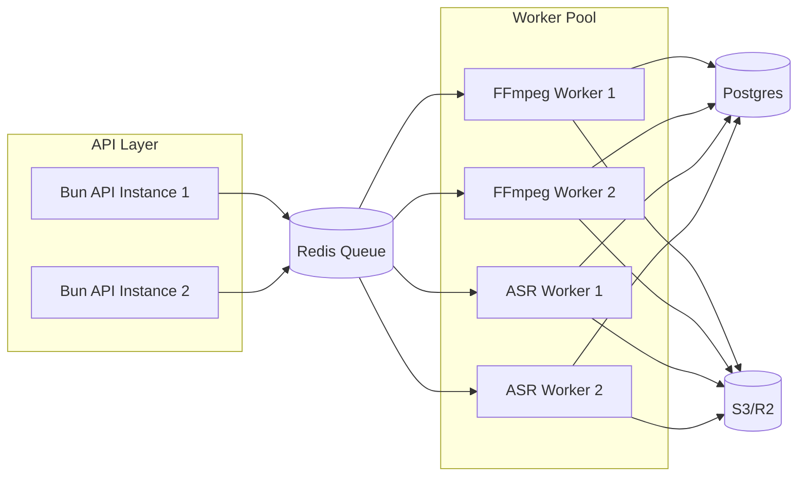

# design.md — High-Performance YouTube Clip Maker

## Overview

This design describes the most performant architecture for our YouTube Clip Maker service. We will maximize throughput, minimize latency, and isolate workloads to fully utilize system resources while staying cost-efficient.

Key strategies:

-   **Bun main API thread** for request handling and orchestration.
-   **Dedicated Bun Workers** for media processing (FFmpeg) and ASR transcription.
-   **In-memory + Redis hybrid queue** for job scheduling, backpressure, and distribution.
-   **Local NVMe scratch space** for temporary files to avoid network latency.
-   **S3/R2 storage** for result delivery with signed URLs.
-   **Optional GPU node pool** for ASR to drastically reduce transcription time.

---

## Architecture Diagram

```mermaid
graph TD
    C[Client (Web/UI/API Consumer)] -->|REST JSON| A[Bun API (Elysia)]
    A -->|enqueue job| Q[Job Queue (Redis)]
    Q -->|dispatch| W1[Bun Worker: FFmpeg]
    Q -->|dispatch| W2[Bun Worker: ASR]
    W1 -->|writes| S[(Local NVMe Scratch)]
    W2 -->|writes SRT| S
    S -->|upload| R[(S3/R2 Storage)]
    R -->|signed URL| A
    A -->|status/result JSON| C
```

---

## Processing Flow

1. **Job Creation**

    - Validate payload via Zod.
    - Generate Job ID.
    - Push to Redis queue with metadata.

2. **Worker Scheduling**

    - **FFmpeg Workers**: Pull jobs, fetch source (upload or yt-dlp), process clip, write to NVMe.
    - **ASR Workers**: If subtitles requested, pull transcription jobs, process with whisper.cpp GPU (or hosted API), write `.srt`.

3. **Result Storage**

    - Upload MP4 and optional SRT to S3/R2.
    - Update job status in Postgres.

4. **Delivery**

    - API returns signed URLs via `GET /api/jobs/:id/result`.

---

## Deployment Topology



---

## Performance Optimizations

-   **Stream copy first**: Use `ffmpeg -ss start -to end -c copy` when possible.
-   **GPU-accelerated ASR**: Whisper with CUDA or hosted API for speed.
-   **Parallelization**: Limit per-worker concurrency to avoid CPU starvation, scale horizontally.
-   **Chunked upload** to S3 for large files to avoid blocking.
-   **Local caching**: Cache common YouTube sources briefly to avoid repeat downloads.
-   **Health checks**: Remove slow or dead workers from Redis queue rotation.

---

## Data Flow Optimization

-   Temporary processing happens on **local NVMe** → fastest possible I/O.
-   Immediate upload to S3 once processing finishes.
-   Expire files from scratch space quickly to free I/O bandwidth.

---

## Observability

-   **Metrics**: job duration histograms, FFmpeg time-to-first-byte, ASR duration.
-   **Structured logs**: correlated with job IDs.
-   **Alerts**: high failure rates, queue backlog thresholds.

---

## Future Scaling

-   **Multi-node**: Redis and Postgres centralize state; API and workers can scale independently.
-   **Specialized workers**: Dedicated GPU nodes for ASR; CPU-heavy nodes for FFmpeg.
-   **Edge caching**: CDN distribution of results for global low-latency delivery.
