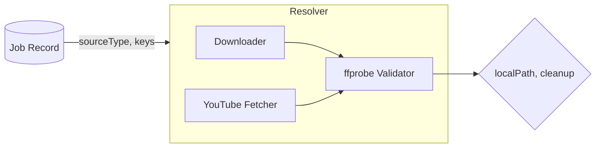
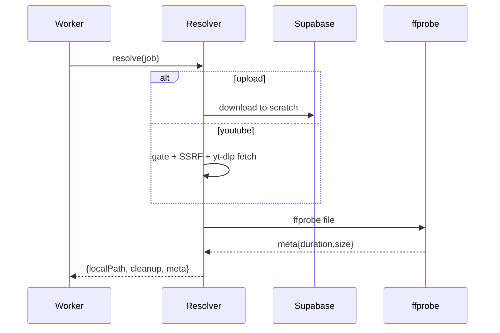

<!-- artifact_id: e2f5f9d7-33a2-4f9b-bc2a-2c2b2f90b3b1 -->

# design.md — Media IO (Source Resolver)

## Overview

The Media IO component resolves inputs to a fast local path on NVMe for FFmpeg. It supports two modes: Supabase upload objects (primary path) and optional YouTube via yt-dlp behind a hard feature gate. It includes SSRF defenses, size/duration validation via ffprobe, deterministic temp paths, and a cleanup contract.

---

## Architecture



Core components:

-   Downloader: streams from Supabase Storage to local file
-   YouTube Fetcher: runs yt-dlp with guarded args and allowlist validation
-   ffprobe Validator: extracts `format.duration`, `format.size`, `streams` and enforces caps

---

## Components & Interfaces

```ts
export interface ResolveResult {
    localPath: string;
    cleanup: () => Promise<void>;
    meta: { durationSec: number; sizeBytes: number; container?: string };
}

export interface SourceResolver {
    resolve(job: {
        id: string;
        sourceType: 'upload' | 'youtube';
        sourceKey?: string; // Supabase path
        sourceUrl?: string; // YouTube URL
    }): Promise<ResolveResult>;
}
```

Errors (ServiceResult pattern):

-   SOURCE_NOT_FOUND, YTDLP_DISABLED, INPUT_TOO_LARGE, SSRF_BLOCKED, DOWNLOAD_FAILED, FFPROBE_FAILED

---

## Env & Config

-   SCRATCH_DIR (default: /tmp/ytc)
-   SUPABASE_URL, SUPABASE_SERVICE_ROLE_KEY, SUPABASE_STORAGE_BUCKET
-   MAX_INPUT_MB (default: 1024)
-   MAX_CLIP_INPUT_DURATION_SEC (default: 7200)
-   ENABLE_YTDLP (default: false)
-   ALLOWLIST_HOSTS (comma-separated domains for external fetch; optional)

---

## Implementation Details

1. Scratch layout

-   `${SCRATCH_DIR}/sources/{jobId}/` directory per job
-   File name `source.<ext>` where ext derived from Supabase key or yt-dlp best container

2. Supabase download

-   Use @supabase/supabase-js with service role key
-   Use createReadStream (if available) or range reads piped to fs.createWriteStream
-   Emit metric `mediaio.download.bytes`

3. YouTube fetch (gated)

-   Validate URL: http(s) only, host allowlist (if set), DNS resolves to public IP; reject loopback/link-local/private
-   Exec: `yt-dlp -f "bv*+ba/b" -o <dir>/source.%(ext)s --quiet --no-progress --no-cache-dir --no-part <url>`
-   Enforce size by `--max-filesize <MAX_INPUT_MB>m` where supported; otherwise post-check

4. ffprobe validation

-   Exec: `ffprobe -v error -print_format json -show_format -show_streams <file>`
-   Parse JSON, compute durationSec and sizeBytes
-   Enforce caps; on failure, cleanup and return INPUT_TOO_LARGE

5. Cleanup

-   Return cleanup() which removes the per-job scratch dir
-   On any error after file creation, attempt unlink/rmdir recursively

6. Telemetry

-   Surround resolve() with timer; log start/finish with jobId
-   Emit `mediaio.resolve.duration_ms`, `mediaio.ffprobe.duration_ms`, `mediaio.ytdlp.duration_ms`

---

## Security Considerations

-   All logs pass through redaction; never log full URLs or tokens
-   SSRF guard on any external URL: block non-public IPs; optional domain allowlist
-   Ensure yt-dlp process inherits a minimal env without secrets
-   Validate file paths to avoid traversal beyond SCRATCH_DIR

---

## Testing Strategy

-   Unit tests (mocked fs/exec):
    -   resolves upload with existing file (simulated)
    -   rejects when ENABLE_YTDLP=false
    -   SSRF blocks private IP URL
    -   ffprobe cap exceeded → INPUT_TOO_LARGE
-   Integration tests (optional):
    -   with Supabase test bucket, download small object and probe
    -   with yt-dlp installed and ENABLE_YTDLP=true on CI, fetch a short public sample

---

## Sequence (resolve)


